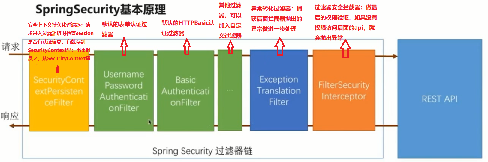
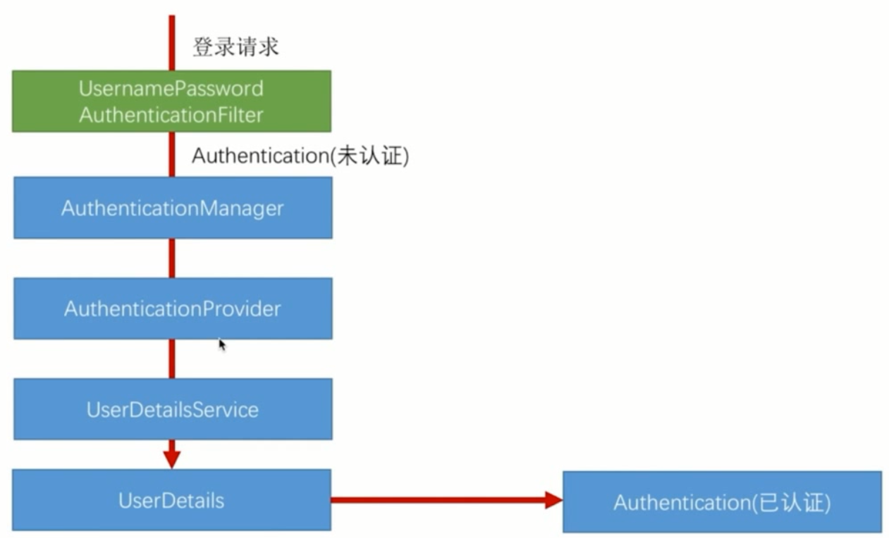
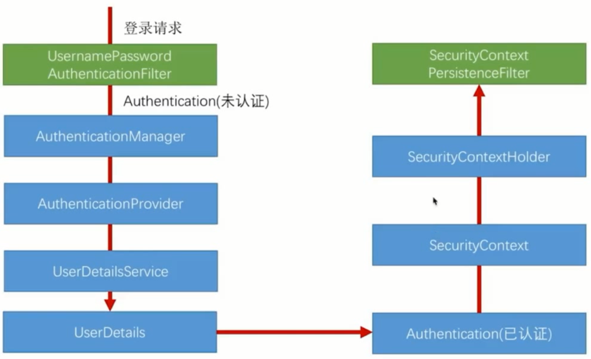

> by Yuanwl

# spring-security 快速入门和基本原理

## 一、使用步骤

### （一）一般步骤

1. pom 文件引入 security 等依赖；
2. application.properties 定义配置；
3. 继承 WebSecurityConfigurerAdapter 自定义 security 的各种配置，和其他相关的自定义类，我一般把这些类都放在 security 包里；
4. 写 controller、service、dao 等类；
5. 写页面等；
6. ...

### （二）自定义项

1. 自定义用户认证逻辑

    - 处理用户校验逻辑：用户实体类 [User](src/main/java/xyz/yuanwl/model/User.java) 可实现 UserDetails 接口，重写其中几个方法，供用户校验时用；

    - 处理用户信息获取逻辑：定义一个 [UserService](src/main/java/xyz/yuanwl/service/UserService.java)，实现 UserDetailsService 接口，重写接口中的 loadUserByUsername 方法，通过该方法查询到需要认证的用户信息；

    - 处理加密解密：可以创建一个组件 [MyPasswordEncoder](src/main/java/xyz/yuanwl/security/MyPasswordEncoder.java) 实现 PasswordEncoder，重写里面的两个方法，供注册时加密和校验时匹配密码用；

2. 个性化用户认证流程

    - 自定义登录页和登录校验接口：在 AppSecurityConfig.configure(HttpSecurity http) 方法里实现；

    - 自定义认证成功处理类：定义一个 [AppAuthenticationSuccessHandler](src/main/java/xyz/yuanwl/security/AppAuthenticationSuccessHandler.java) 实现 AuthenticationSuccessHandler，在里面利用 RedirectStrategy 实现验证用户成功后处理不同用户跳转到不同的页面。如果不定义这个类，可以调用 AppSecurityConfig.configure(HttpSecurity http) 方法里的 .formLogin()....defaultSuccessUrl("登录成功后跳转的页面url") 或者 successForwardUrl("...") 方法做跳转；

    - 自定义认证失败处理类：定义一个 [AppAuthenticationFailureHandler](src/main/java/xyz/yuanwl/security/AppAuthenticationFailureHandler.java) 实现 AuthenticationFailureHandler，使用方法和成功的差不多。如果不定义这个类，默认跳到登录页；

3. 使 security 自定义配置生效

    创建一个 [AppSecurityConfig](src/main/java/xyz/yuanwl/security/AppSecurityConfig.java) 继承 WebSecurityConfigurerAdapter，在里面自定义 security 的各种配置，比如：

    - 创建一个 AuthenticationProvider bean，然后把上面的 UserService、MyPasswordEncoder 对象设置给它，然后在 configure(AuthenticationManagerBuilder auth) 方法里把 AuthenticationProvider bean 设置给 auth 对象；

    - 在 configure(HttpSecurity http) 设置各种拦截、放行规则，并把 AppAuthenticationSuccessHandler、appAuthenticationFailureHandler 设置给 http 对象；

## 二、基本原理

### （一）认证过滤器链

**讲解：**

1. 比如，未登录前，访问 /user，这时黄框拿不到认证信息；
2. 一直往右走，绿色框都没匹配到这个url，不做处理；
2. 直到橘色框发现访问这个url需要先登录，而用户还没登录，就抛出未验证异常；
3. 蓝色框捕获到异常，根据配置（假如配置了表单验证），把请求导航到表单验证过滤器去（第一个绿色框）；
4. 绿色框检验用户名和密码，如果匹配就验证通过，然后再直接跳转到橘色框；
5. 橘色框这次再检查，发现用户已经是登录状态，就放行，允许访问 /user；

### （二）认证处理流程

自己打断点跟代码理解流程。

### （三）认证结果在多个请求之间共享

自己打断点跟代码理解流程。

